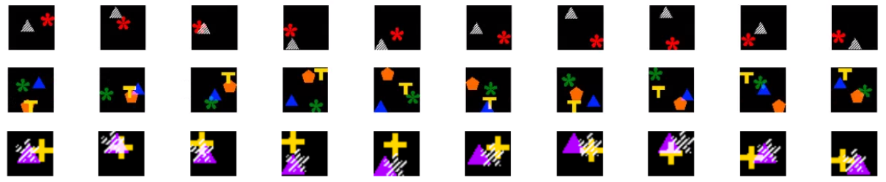

## The Flying Shapes dataset & tracking model

This is a potentially infinite dataset of coloured shapes which bounce around on a black background.



It is a toy dataset suitable for testing methods for video tracking, detection, localization, etc.

You can set the various parameters of the data handler (number of shapes, size, batch_size, etc.) to create your own dataset (on the fly, or to save for later), but we provide a .pkl file and example script, detailed below, to get you started.

We also include tensorflow code for a single-frame tracker, and explore the learned representations from this tracker.


### Requirements

The Flying Shapes dataset handler relies only on `numpy`, and displaying the frames of the dataset uses `matplotlib`.

Models trained in `train,py` rely on `tensorflow` and `sonnet`.


### Files in this repo

```
test_flying_shapes.py
```
A small script useful for showing how to use the data handler, i.e. get a batch of data, and display it.

```
train.py
```
Trains a single-frame tracking model (LSTM on top of conv layers) on the flying_shapes dataset, saving parameters and outputting training curves.

```
explore_representations.py
```
Creates a dataset of state-label pairs by loading a trained model, fpropping a video, and saving the final lstm states with the sequence labels (i.e. colour/shape of object to be tracked in the video).

Then separates this dataset into train:val:test, and trains a classifier (linear, 1-layer MLP, or 2-layer MLP) to classify label from state.

The purpose of this experiment is to explore the representations learned by different tracking models.


```
models.py
```
Contains convnets.

```
util.py
```
Utilities for calculating metrics related to image processing.


### References

This dataset is extended from code released along with the following paper:

```
@inproceedings{srivastava15_unsup_video,
  author    = {Nitish Srivastava and Elman Mansimov and Ruslan Salakhutdinov},
  title     = {Unsupervised Learning of Video Representations using {LSTM}s},
  booktitle = {ICML},
  year      = {2015}
}
```
